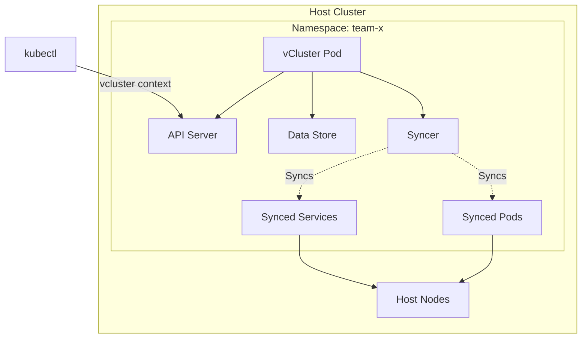

## What is vCluster?

**vCluster** creates fully functional virtual Kubernetes clusters that run inside namespaces of a host cluster. Each virtual cluster has its own API server, runs on shared or dedicated infrastructure, and gives you flexible tenancy options—from simple namespaces to fully dedicated clusters.

<Note>
  **Trusted by the industry**: Over 40 million virtual clusters have been deployed by companies like Adobe, CoreWeave, Atlan, and NVIDIA.
</Note>

Virtual clusters provide complete Kubernetes API isolation while sharing the underlying infrastructure of the host cluster. Think of them as lightweight Kubernetes clusters that give you all the power of a full cluster without the operational overhead.

## Why Virtual Clusters?

Traditional Kubernetes multi-tenancy relies on namespaces, which have significant limitations. Virtual clusters solve these problems by providing:

<CardGroup cols={2}>
  <Card title="Cluster-Scoped Resources" icon="layer-group">
    Use CRDs, namespaces, cluster roles, and other cluster-scoped resources without host cluster conflicts
  </Card>
  <Card title="True Isolation" icon="shield-halved">
    Complete separation with dedicated control planes and API servers for each tenant
  </Card>
  <Card title="Cost Efficiency" icon="dollar-sign">
    Much cheaper than full clusters—runs as a single pod with shared host resources
  </Card>
  <Card title="Ease of Use" icon="rocket">
    Created in seconds with a single command, works in any Kubernetes cluster
  </Card>
  <Card title="Cluster-Wide Permissions" icon="key">
    Grant users admin access inside their vCluster while limiting host cluster permissions
  </Card>
  <Card title="Version Flexibility" icon="code-branch">
    Test different Kubernetes versions inside a single host cluster
  </Card>
</CardGroup>

## Key Concepts

### Control Plane Isolation

Each vCluster runs its own Kubernetes control plane components:

- **API Server**: Dedicated API endpoint for complete API isolation
- **Controller Manager**: Manages Kubernetes controllers within the virtual cluster
- **Data Store**: Embedded etcd or external database (PostgreSQL, MySQL, RDS)

This isolation ensures that tenants interact only with their own virtual cluster, never directly with the host cluster.

### Resource Syncing

vCluster uses bidirectional resource synchronization to connect virtual and host clusters:

<Steps>
  <Step title="Virtual Cluster Creation">
    Users create resources (pods, services, secrets) in the virtual cluster through its API server
  </Step>
  <Step title="Syncing to Host">
    The syncer component watches for resources and syncs them to the host cluster namespace
  </Step>
  <Step title="Physical Execution">
    Workloads run on the host cluster's nodes, using its CNI, CSI, and infrastructure
  </Step>
  <Step title="Syncing from Host">
    Status updates and events flow back from host to virtual cluster automatically
  </Step>
</Steps>

This approach gives users a complete Kubernetes experience while leveraging the host's platform stack.

<Tip>
  By default, vCluster syncs pods, services, secrets, configmaps, and persistent volume claims. You can configure additional resources like ingresses, network policies, and custom resources.
</Tip>

### Shared vs. Isolated Infrastructure

vCluster supports multiple deployment architectures with different levels of isolation:

| Architecture | Node Isolation | CNI/CSI Isolation | Best For |
|--------------|----------------|-------------------|----------|
| **Shared Nodes** | ❌ | ❌ | Development, testing, maximum density |
| **Dedicated Nodes** | ✅ | ❌ | Production workloads, compliance |
| **Private Nodes** | ✅ | ✅ | Full isolation, GPU workloads |
| **Standalone** | ✅ | ✅ | Bare metal, edge, no host cluster |

## Architecture Overview

vCluster follows a lightweight architecture that maximizes efficiency:



The vCluster control plane runs as a single StatefulSet in a host namespace. Users interact with the virtual cluster's API server, completely isolated from the host. The syncer ensures workloads execute on host infrastructure.

<Note>
  For more detailed architecture information, see the [Architecture Overview](/architecture/overview) section.
</Note>

## Main Benefits

### Multi-Tenancy Without Compromise

Provide teams with full Kubernetes clusters instead of limited namespace access:

- Admin privileges inside their vCluster
- Ability to install cluster-scoped operators and CRDs
- Complete isolation from other tenants
- Minimal permissions required on the host cluster

### Rapid Environment Provisioning

Create isolated Kubernetes environments in seconds:

```bash
# Create a vCluster in under 30 seconds
vcluster create my-vcluster --namespace team-x
```

Perfect for:
- CI/CD pipelines requiring clean Kubernetes environments
- Development and testing workflows
- Preview environments for pull requests
- Temporary sandbox environments

### Cost Optimization

Consolidate multiple teams or projects onto fewer clusters:

- **70% cost reduction** reported by Fortune 500 companies
- Share expensive infrastructure (GPU nodes, storage, load balancers)
- Sleep mode for inactive clusters to save resources
- Higher density than traditional cluster-per-tenant approaches

### GPU and AI/ML Workloads

Optimize GPU utilization across teams:

- Maximize GPU utilization without sacrificing isolation
- Support multiple schedulers (Karpenter, Volcano, YuniKorn)
- Private nodes with full CNI/CSI control for AI workloads
- Auto-scaling with Auto Nodes feature

## Common Use Cases

<CardGroup cols={2}>
  <Card title="GPU Cloud Providers" icon="server" href="/use-cases/gpu-platforms">
    Launch managed Kubernetes for GPU customers with isolated, production-grade environments
  </Card>
  <Card title="Internal GPU Platform" icon="microchip" href="/use-cases/gpu-platforms">
    Self-service GPU access for AI/ML teams with maximum utilization
  </Card>
  <Card title="Multi-Tenancy" icon="users" href="/use-cases/multi-tenancy">
    Give teams full cluster access while maintaining security boundaries
  </Card>
  <Card title="Development & Testing" icon="flask" href="/use-cases/development-testing">
    Rapid provisioning of isolated test environments for CI/CD
  </Card>
  <Card title="Bare Metal Kubernetes" icon="hard-drive">
    Run Kubernetes on bare metal with zero VMs and strong isolation
  </Card>
  <Card title="Cost Savings" icon="piggy-bank" href="/use-cases/cost-optimization">
    Consolidate clusters and reduce Kubernetes infrastructure costs by 70%
  </Card>
</CardGroup>

## How vCluster Compares

vCluster offers a unique approach compared to other multi-tenancy solutions:

| Feature | Namespaces | vCluster | Separate Clusters |
|---------|-----------|----------|-------------------|
| **Isolation** | Limited | Strong | Complete |
| **Cluster-scoped resources** | ❌ | ✅ | ✅ |
| **Admin permissions** | ❌ | ✅ | ✅ |
| **Cost** | Low | Low | High |
| **Provisioning time** | Seconds | Seconds | Minutes/Hours |
| **Operational overhead** | Low | Low | High |
| **Kubernetes version** | Same as host | Flexible | Any |

vCluster bridges the gap between namespaces and full clusters, giving you the best of both worlds.

## What's New

vCluster continues to evolve with cutting-edge features:

<AccordionGroup>
  <Accordion title="v0.30 - VPN & Network Isolation">
    Tailscale-powered overlay networks and automated network isolation for hybrid infrastructures with vCluster VPN and Netris integration.
  </Accordion>
  <Accordion title="v0.29 - Standalone Mode">
    Run vCluster without a host cluster—deploy the control plane directly on bare metal or VMs for the highest level of isolation.
  </Accordion>
  <Accordion title="v0.28 - Auto Nodes">
    Karpenter-powered dynamic autoscaling for private nodes with automatic provisioning and deprovisioning.
  </Accordion>
  <Accordion title="v0.27 - Private Nodes">
    External nodes with full CNI/CSI isolation join the virtual cluster directly with their own networking stack.
  </Accordion>
  <Accordion title="v0.26 - Hybrid Scheduling">
    Multiple scheduler support for AI/ML workloads and fine-grained namespace synchronization.
  </Accordion>
</AccordionGroup>

## Getting Started

Ready to create your first virtual cluster? Here's what comes next:

<CardGroup cols={2}>
  <Card title="Quickstart" icon="rocket" href="/quickstart" className="rounded-xl">
    Get your first vCluster running in under 5 minutes
  </Card>
  <Card title="Installation" icon="download" href="/installation" className="rounded-xl">
    Detailed installation instructions for all platforms
  </Card>
  <Card title="Architecture Deep Dive" icon="sitemap" href="/architecture/overview" className="rounded-xl">
    Understand how vCluster works under the hood
  </Card>
  <Card title="Configuration" icon="sliders" href="/deployment/configuration" className="rounded-xl">
    Learn how to configure vCluster for your needs
  </Card>
</CardGroup>

## Community and Support

Join thousands of vCluster users:

- **[GitHub](https://github.com/loft-sh/vcluster)**: Star the project and contribute
- **[Slack](https://slack.loft.sh/)**: Join 5K+ community members
- **[Documentation](https://www.vcluster.com/docs)**: Comprehensive guides and references
- **[Blog](https://loft.sh/blog)**: Latest updates and best practices

<Warning>
  vCluster requires Kubernetes 1.18+ on the host cluster and Helm 3.10.0+ for installation.
</Warning>
